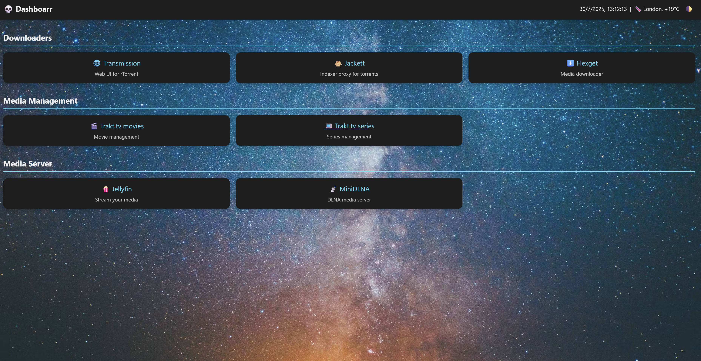

# Dashboarr

A clean, modern web dashboard for managing your home media server and downloader services. Built with vanilla HTML, CSS, and JavaScript for simplicity and performance.

## Features

- **Clean Interface**: Modern dark/light theme toggle with smooth transitions
- **Simple**: Static page, configurable through json files.
- **Low resource usage**: Memory usage around 1MB when idle.

## Screenshot



## Installation

1. Clone the repository:
```bash
git clone https://github.com/pixelotes/dashboarr.git
cd dashboarr
```

2. Serve the files using any web server. For example:
```bash
# Using Python 3
python -m http.server 8000

# Using Node.js (if you have http-server installed)
npx http-server

# Using PHP
php -S localhost:8000
```

3. Open your browser and navigate to `http://localhost:8000`

## Configuration

### config.json
Create a `config.json` file to customize your dashboard:

```json
{
  "dashboardName": "My Home Server",
  "weatherCity": "Your City",
  "wallpaperPath": "path/to/your/wallpaper.jpg"
}
```

### services.json
The `services.json` file defines your service categories and links:

```json
[
  {
    "category": "Downloaders",
    "services": [
      {
        "name": "Transmission",
        "url": "http://your-server:9091",
        "icon": "🌐",
        "description": "BitTorrent client web UI"
      }
    ]
  }
]
```

**Service Object Properties:**
- `name`: Display name for the service
- `url`: URL to access the service
- `icon`: Emoji or icon to display
- `description`: Brief description of the service

## Docker deployment

### 1. Build the docker image
```bash
#Clone the repo
git clone https://github.com/pixelotes/dashboarr.git
cd dashboarr

# Build the image
docker build -t dashboarr:latest .

# Build with a specific tag
docker build -t your-username/dashboarr:v1.0 .
```

### 2. Run the image
```bash
# Basic run command
docker run -d \
  --name dashboarr \
  -p 3000:80 \
  dashboarr:latest

# Run with mounted config files (recommended)
docker run -d \
  --name dashboarr \
  -p 3000:80 \
  -v $(pwd)/config.json:/usr/share/nginx/html/config.json:ro \
  -v $(pwd)/services.json:/usr/share/nginx/html/services.json:ro \
  dashboarr:latest
```

## Docker compose deployment

### 1. Start the stack
```bash
# Start in detached mode
docker compose up -d

# Start and view logs
docker compose up

# Build and start (if you made changes)
docker compose up --build -d
```

### 2. Manage the stack
```bash
# View logs
docker compose logs -f dashboarr

# Stop the stack
docker compose down

# Stop and remove volumes
docker compose down -v

# Restart a specific service
docker compose restart dashboarr

# Update and restart
docker compose pull && docker-compose up -d
````

## License

This project is open source. Feel free to use and modify as needed.
